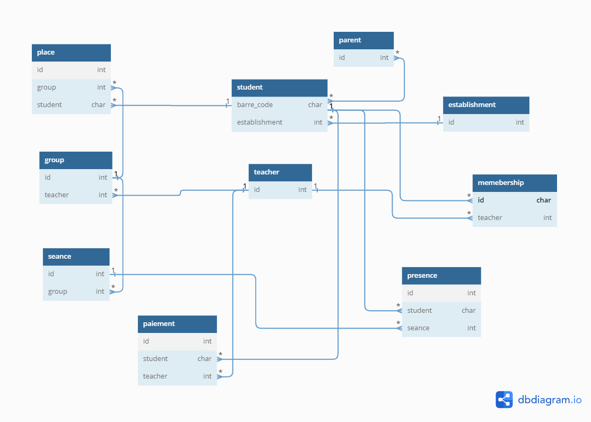

# PROCHOOL

Simple management school system, to handle absences and presences, with memebership for students

## Contents

[TOC]

## Students

Student application contiane this folow models, packed all students behavior:

- Subscription
- Student detailed informaitons, like parents and establishments

## Database Sample

## CORS HEADERS

## STUDENTS:
Create a student with generated barre code, and check his exsitance with name and phone
Student useful information: is paid or not, last presence information, student place in group, payment list, presence list, group list.

### Problems

Browser can hide you from resources from a different domain, (you can use just your domain or sub)
Cross-Origin Resources Sharing come to rescue

- Access-Control-Allow-Origin: to allow the use of our resources
- Access-Control-Allow-Headers: to allow the send requests with specifics headers
- Access-Control-Allow-Creadentials | 'true': to allow cockies

# Some todos for Tidjini:

- CRUD operations for all objects Almost DONE.
- Track function by function
- Groups Functions into services modules
- Separate the business logic
- Toughts and reviews todo: 
    - app/api/api-modules
    - urls : groupe/<id>/places/<id> | student/<id>/payments/<id>
    - put all urls related app in app/ulrs.py remove api_urls
    - urls / make a global api_url in settings to get all your urls in one urlpatterns
    - Search for get or none for models level
    - TESTING this stuff
     
- Business Logic:
  - open course
  - set student and presence
  - create a payment
  - confirm a payment (Barre Code)
  - cancel presence
  - cancel payment
  - reporting stuff
